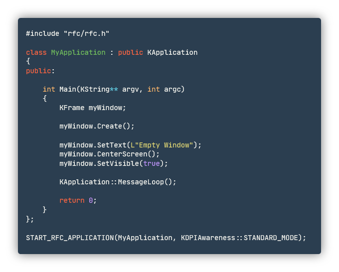

# RFC Framework

**Lightweight, High-DPI Native C++ GUI Library for Windows**  
*Developed by CrownSoft*

RFC Framework helps you create responsive, modern high-DPI Windows applications with clean, minimal, object-oriented C++ code. The framework bypasses heavy runtimes, generating a highly optimized and lightweight code.

* **Minimum Supported OS:** Windows Vista or later.
* **Architecture:** Exception-free, ultra-lightweight native Win32 wrappers.

---

## 🛠️ Getting Started

1. Run **`rfc/Generator.exe`** included in the repository.
2. Select your required feature modules.
3. Choose your output destination and click **"Generate"**.
4. The utility compiles a unified header and source file pair ready to pull directly into Visual Studio or custom build system.
5. Check out the `examples/` directory to review samples codes.

---

## 🤖 AI-Native Development & Interactive Training

This repository features built-in **AI Context Optimization Layers** (`AGENTS.md` and `symbols.md`). If you use an AI-capable IDE or an agent, the environment automatically digests the codebase layout without blowing through your token limits or hallucinating class names.

### 🎓 For Newcomers: "Zero-Docs" Automated Tutoring
You do not need to spend hours hunting down wikis or dissecting class lineages. The framework can teach you interactively:
1. Open this project directory inside your AI-enabled editor (agent).
2. Open your AI chat pane and type: **`"teach me rfc"`** or **`"how do I start"`**.
3. **What happens:** The agent triggers **Onboarding Mode** via `AGENTS.md`. It scans your public headers and cross-references the existing examples to teach you the architecture piece-by-piece—guiding you through initializing `KApplication`, spinning up a standalone frame window, and injecting functional widgets one by one.

### ⚡ For Power Users & Contributors: Surgical Refactoring
For regular users, the AI acts as a minimal-token, rule-compliant copilot.
* The system enforces strict architectural constraints: **No C++ exceptions**, **No STL containers**, absolute `noexcept` compliance.
* The agent leverages the lightweight codebase skeleton map (`symbols.md`) to pull structural context surgically, saving your context window overhead while writing correct, native-behaving additions.

---

Send your bug reports/suggestions to support@crownsoft.net

Logo designed by Fernando Augusto Birck (http://www.fergonez.net)

Visit http://www.crownsoft.net for more information.