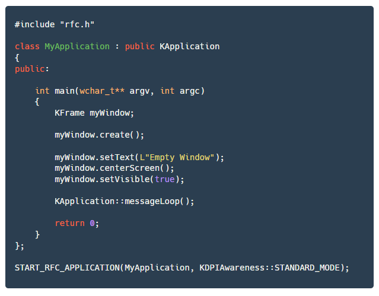

# RFC Framework

RFC Framework v1.0 By CrownSoft.

RFC Framework is a C++ framework which helps you to create high DPI Windows applications with clean and minimal code. By using this framework, you can write C++ desktop applications in object oriented fashion!

Run the "Generator.exe" and select required modules. Browse the output location and press "Generate" button. It will generate single header and cpp file which can be used with your project.

Checkout examples dir for usage of this framework.

The minimum supported OS is Windows XP.

Send your bug reports/suggestions to support@crownsoft.net

Logo designed by Fernando Augusto Birck (http://www.fergonez.net)

Visit http://www.crownsoft.net for more information.